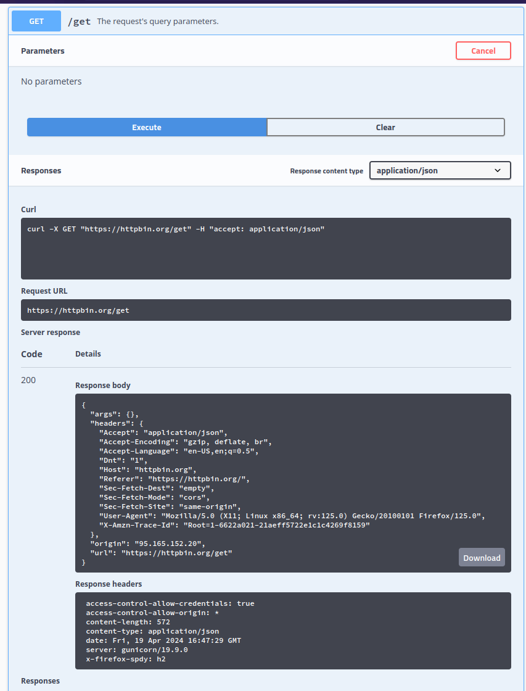
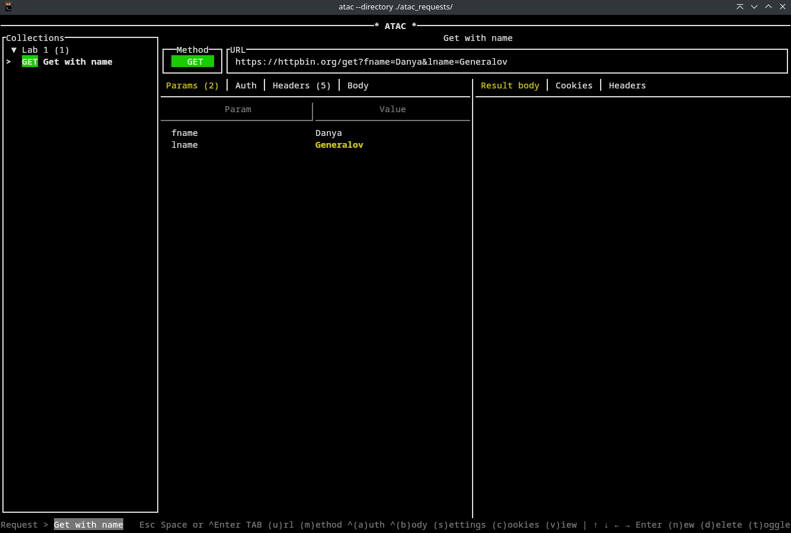
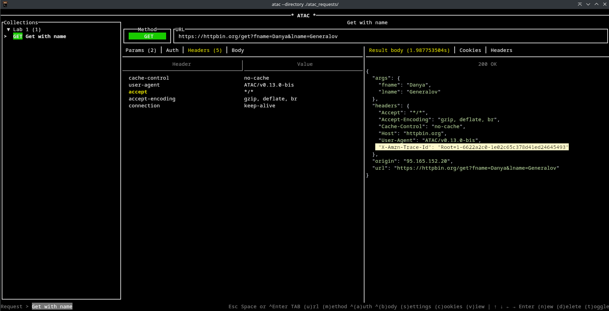
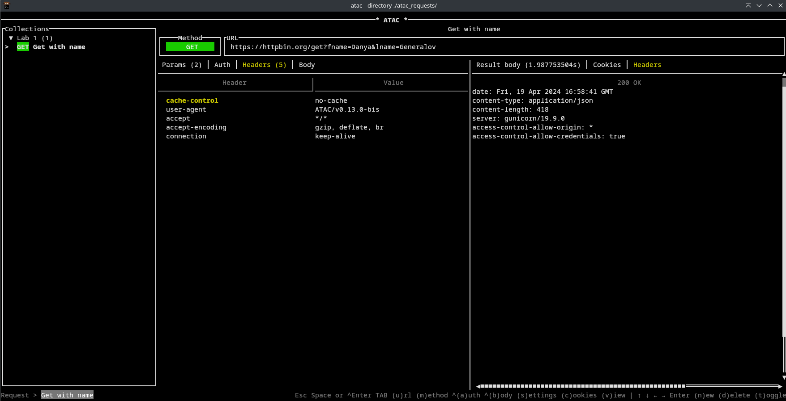
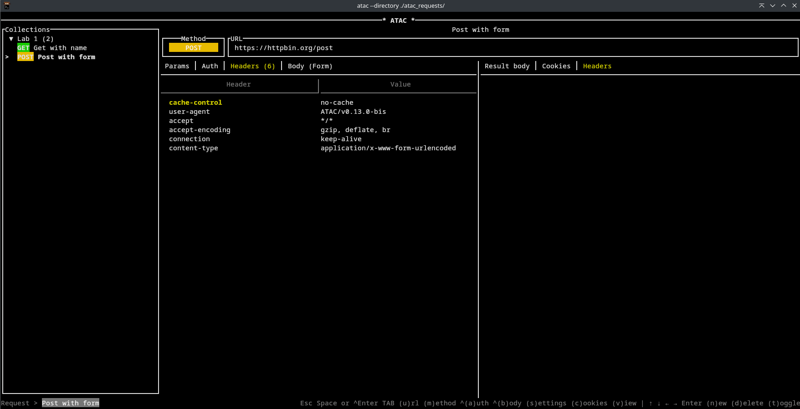
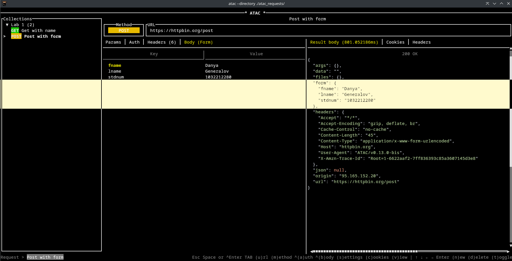
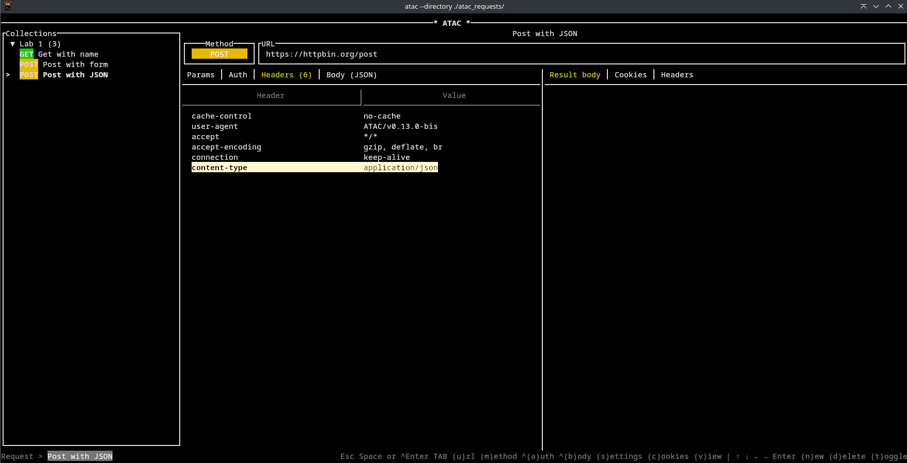

# Лабораторная работа 1
## Генералов Даниил, 1032212280

> Данная лабораторная работа посвящена HTTP запросам типа GET и POST, которые чаще всего используются в открытых API различных Web-сервисов. Для лучшего усвоения теоретического материала, учащиеся должны будут вручную составить несколько запросов и проинтерпретировать ответы, полученные от сервера. Можно использовать curl, HTTPie, Postman или любое другое средство, главное чтобы вы могли просмотреть исходный код HTTP запроса и ответа.

> [!TIP]
> Исходный код этого файла доступен в git-репозитории: https://github.com/danya02/rudn-year3-api-labs/blob/main/lab1/README.md

## ATAC

Для отправки запросов и просмотра ответов в этой работе я буду использовать утилиту [ATAC](https://github.com/Julien-cpsn/ATAC).
Эта TUI-программа позволяет делать HTTP-запросы и сохранять типовые варианты, аналогично Postman и HTTPie.
Ее отличительным свойством является то, что она работает чисто из терминала,
что удобно для моего workflow.

Коллекция запросов, которые я использовал для этой работы, находится в пути `./atac_requests` рядом с этим Markdown-файлом.

## HTTP GET с параметрами

Для начала следует отправить GET-запрос, указав параметры.
GET-параметры передаются как компонент адреса, по которому выполняется запрос.

Веб-интерфейс httpbin.org не позволяет указывать параметры,
но он позволяет посмотреть содержимое ответа сервера (которое включает, какие Headers он видел от нас),
а также позволяет посмотреть те Headers, которые мы видели от него.

Теперь мы знаем, что следует использовать URL `https://httpbin.org/get`.
Мы можем ввести его в нашу утилиту,
а также добавить GET-параметры.
Заметим, что они добавляются в конце URL:
финальный путь выглядит как `/get?fname=Danya&lname=Generalov`.

По умолчанию наш клиент посылает слегка другие Headers, чем Firefox:
самое явное -- он называет себя по-другому в header `User-Agent`,
а также его header `Accept` имеет значение `*/*`,
потому что программа не знает, что собирается вернуть тот сервер,
в то время как Firefox знает (из данных, которые предоставил ему JavaScript-код),
что мы ожидаем от сервера увидеть `application/json`.

Мы также видим, что сервер видит от нас один Header, который мы не отправляли:
`X-Amzn-Trace-Id`.
Этот header добавляет [AWS Application Load Balancer](https://docs.aws.amazon.com/elasticloadbalancing/latest/application/load-balancer-request-tracing.html),
который используется на этом сайте --
это значение появляется в логах, и с помощью него системный администратор может отследить, какие запросы вызывали ошибку и в какой части стека приложения.

Помимо этого, сервер отправил примерно такие же Headers в ответ на наш запрос из ATAC,
как и из Firefox.
Единственное отличие по названиям --
когда мы отправляли запрос из Firefox,
мы увидели Header `X-Firefox-Spdy: h2`.
[Этот Header добавляет Firefox, когда соединение с сервером происходило по HTTP2](https://www.reddit.com/r/firefox/comments/16bv0rw);
он не появляется на проводе между браузером и сервером.

Остальные Headers, которые прислал сервер, это:

- `Date`: указывает точное время на сервере в момент отправки запроса. Это полезно для отслеживания расхождений в часах между сервером и клиентом.
- `Content-Type`: показывает тип того содержимого, которое отправляет сервер в ответе. В данном случае это JSON-данные.
- `Content-Length`: показывает, сколько байтов сервер отправит нам. С помощью этого мы можем решить, хотим ли мы сейчас скачивать весь ответ; также это служит для framing в HTTP/1.1-потоке, чтобы, если сервер отправляет несколько вещей, то клиент мог определить, где находится граница между ними.
- `Server`: называет ПО и информацию про тот сервер, который ответил на этот запрос. Иногда сюда записывают название машины, которая обработала запрос. Здесь же мы видим только, что на сервере запущен [Gunicorn](https://gunicorn.org/) версии 19.9.0.
- `Access-Control-Allow-Origin`: указывает, каким сайтам сервер доверяет, чтобы делиться с ними ответами на запросы. Если сайт не включается в этот список, то JavaScript-код, который запущен на этом сайте, не может увидеть содержимое ответа сервера. В данном случае этот сайт не содержит никакой приватной инфорации, поэтому он разрешает посылать запросы к нему от всех других сайтов.
- `Access-Control-Allow-Credentials`: если другой сайт пытается отправить на этот сайт запрос, который содержит данные авторизации (вроде логинов-паролей и cookies), это указывает, следует ли разрешить этому запросу выполниться. Это позволяет защититься от ситуации, когда вредоносный сайт пытается скачать приватную информацию про вашего пользователя на другом сайте, если так повезло, что вы залогинены в этот другой сайт. Опять же, этот сайт не имеет приватной информации, поэтому он позволяет отправлять запросы с паролями от любого другого сайта.

## HTTP POST с формой

После этого мы отправляем POST-запрос на URL https://httpbin.org/post.
В отличие от GET-запроса, он включает тело -- содержимое, которое будет отправлено после Headers,
так же как сервер отправляет содержимое.
Для того, чтобы сервер правильно интерпретировал наш запрос,
мы также передаем новый Header:
`Content-Type: application/x-www-form-urlencoded`.
Это говорит серверу, что содержимое имеет вид веб-формы, в который данные закодированы URL-совместимой процент-кодировкой.

С помощью этого сервер правильно понял, что мы пытались отправить ему данные формы,
и извлек те три параметра, которые мы передавали ему.

Благодаря наличию этого Header,
можно на один и тот же URL посылать разные типы данных,
и сервер поймет, что их надо обрабатывать по-разному.
Например, если приложение хочет отправить JSON-данные вместо веб-формы,
то нужно лишь указать `Content-Type: application/json`.

Теперь сервер увидел, что это не данные формы, а другие данные,
поэтому он вернул их в другом ключе своего ответа.
Он не пытался десериализовать эти данные,
потому что этот же путь можно использовать для отправки не-JSON данных;
вместо этого входящие данные были отправлены назад в форме строки в ключе `data`.

## Заключение

В этой лабораторной работе мы смогли отправить базовые HTTP-запросы на сервер,
получить ответы и понять их. 

HTTP-запросы являются основой большинства взаимодействий между сервисами в интернете,
и иметь возможность создавать их с нуля -- очень полезно для отладки веб-серверов,
а также автоматизации и других задач взаимодействия с такими системами.